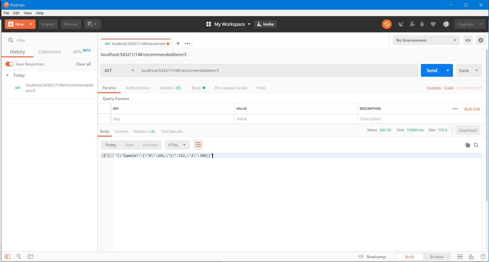
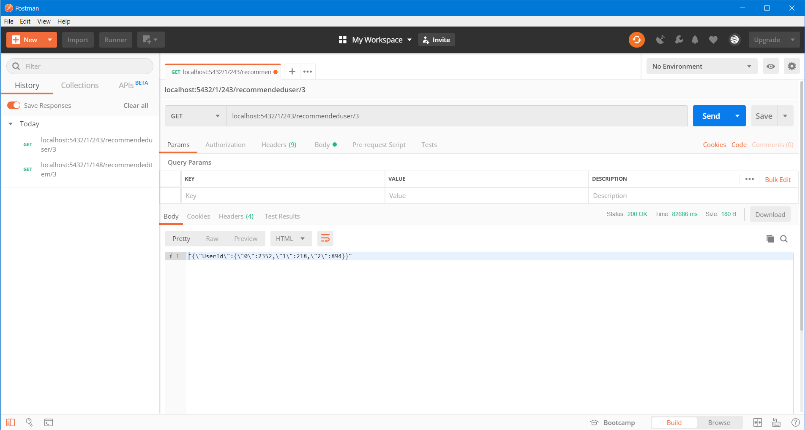

# FP BIG DATA

## Dataset
Dataset : https://www.kaggle.com/dahlia25/metacritic-video-game-comments/downloads/metacritic-video-game-comments.zip/1#metacritic_game_user_comments.csv
 :: dataset Metacritic Video Game Comments

## Strukturtur Sistem

### 1.app.py 
app.py adalah file dimana Aplikasi web Flask yang mendefinisikan REST API engine. Juga merupakan file routing web untuk mengakses fungsi sistem.

### 2.engine.py
engine.py bertujuan mendefinisikan mesin rekomendasi, dimana menjadi tempat komputasi spark.

### 3.server.py
server.py bertujuan menginisialisasi server web CherryPy setelah membuat konteks Spark dan aplikasi web Flask.

### 4.producer.py
producer.py adalah file python producer kafka yang bertujuan untuk membaca dataset dan kemudian mengirim ke kafka server

### 5. consumer.py
consumer.py adalah file python consumer kafka yang bertujuan untuk mengambil dataset dari kafka server yang kemudian di simpan ke dalam file sesuai batch limit tertentu

### 6.fp big data.ipynb
fp big data.ipynb adalah file jupyter notebook mengenai komputasi rekomendasi sistem dengan tahapan tahapannya.

### Model yang digunakan:
1. Model 1: 100000 data pertama
2. Model 2: 100000 data kedua
3. Model 3: 100000 data ketiga

### cara menjalankan:
1. Jalankan zookeeper
2. Jalankan kafka
3. Buat topic di kafka
4. Jalankan producer.py
5. Jalankan consumer.py
6. Jalankan server.py

## Contoh Penggunaan Recommendation System

### 1. localhost:5432/<data_type>/<user_id>/recommendeditem/<item_count> 
  Untuk menampilkan rekomendasi item sejumlah <item_count> kepada user <user_id>
  

### 2. localhost:5432/<data_type>/<item_id>/recommendeduser/<user_count> 
  Untuk menampilkan item <item_id> yang direkomendasi  kepada user <user_id> sejumlah <user_count>
  

### 3. localhost:5432/<data_type>/<user_id>/getratings/<item_id> 
  Untuk menampilkan rating dari inputan item <item> dan user <user_id>
  

