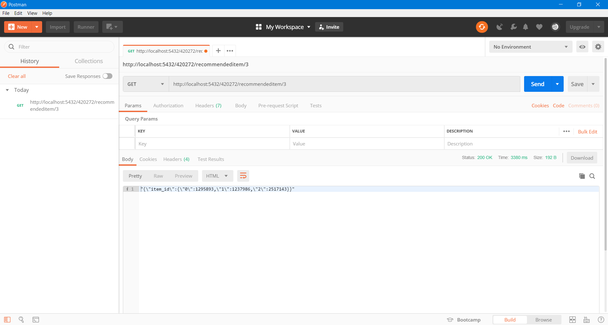
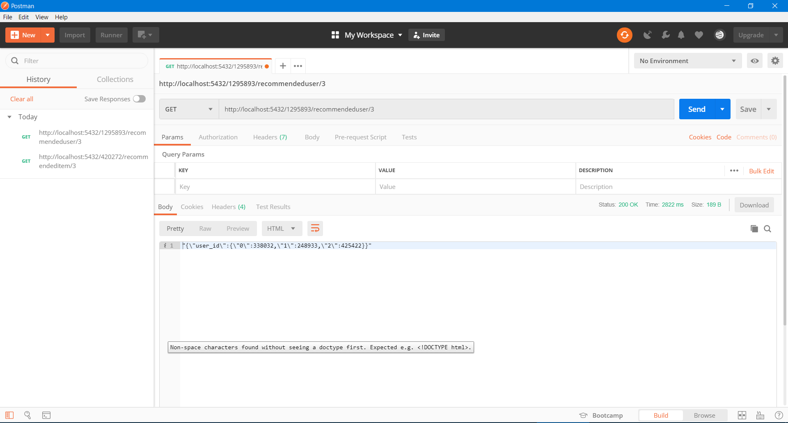

# Implementasi Recommendation System

## Dataset
Dataset : http://jmcauley.ucsd.edu/data/renttherunway/renttherunway_final_data.json.gz  
 :: dataset tersebut berisi feedback dari transaksi clothing fit RentTheRunway

## Strukturtur Sistem

### 1.app.py 
app.py adalah file dimana Aplikasi web Flask yang mendefinisikan REST API engine. Juga merupakan file routing web untuk mengakses fungsi sistem.

### 2.engine.py
engine.py bertujuan mendefinisikan mesin rekomendasi, dimana menjadi tempat komputasi spark.

### 3.server.py
server.py bertujuan menginisialisasi server web CherryPy setelah membuat konteks Spark dan aplikasi web Flask.

### 4.Tugas 4.ipynb
Tugas 4.ipynb adalah file jupyter notebook mengenai komputasi rekomendasi sistem dengan tahapan tahapannya.

## Contoh Penggunaan Recommendation System

### 1. localhost:5432/<user_id>/recommendeditem/<item_count> 
  Untuk menampilkan rekomendasi item sejumlah <item_count> kepada user <user_id>
  

### 2. localhost:5432/<item_id>/recommendeduser/<user_count> 
  Untuk menampilkan item <item_id> yang direkomendasi  kepada user <user_id> sejumlah <user_count>
  

